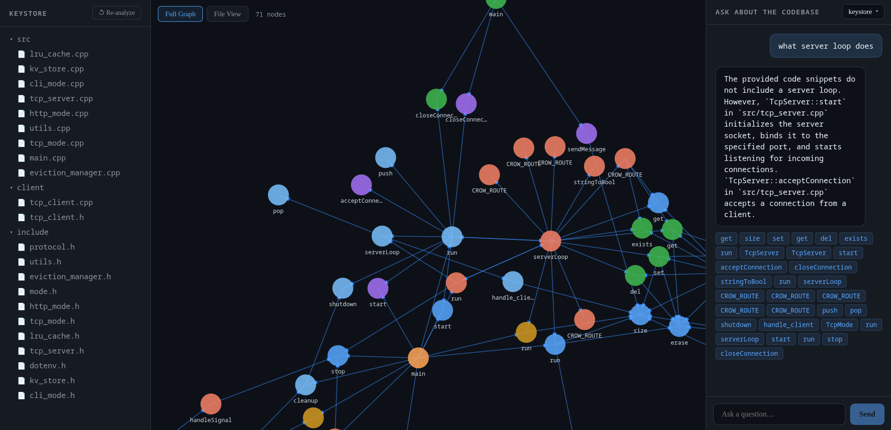

# CodeGraph

CodeGraph lets you drop in a GitHub repository URL and explore the codebase visually. It parses every function in the repo, figures out what calls what, and draws that as an interactive graph. You can also ask plain English questions about the code and get answers back.

It was built because reading an unfamiliar codebase is slow. You either grep around hoping to find the right file, or you spend an hour tracing function calls manually. CodeGraph does that tracing for you and gives you something you can actually look at.



## What it does

When you submit a repo URL, the system clones it, walks through every source file, and extracts all the functions it finds. It then builds a graph where each node is a function and each edge is a call relationship. On top of that it generates vector embeddings for every function so you can search semantically.

The dashboard has three panels. The left panel is a file explorer. Click a file and you see all the functions in it. The center panel is the graph. You can view the full graph across the whole repo, or switch to file view to see just the functions in the file you selected along with anything they call into from other files. Click any node and a small panel appears showing which file it lives in, what line it starts on, and what it depends on. The right panel is a chat interface where you can ask things like "where is authentication handled" or "what happens after a user logs in" and get a real answer with the relevant functions highlighted.

## Languages supported

Python, JavaScript, TypeScript, Go, Rust, Java, C, C++, Kotlin.

## Running it

You need Docker and Docker Compose. That is the only requirement.

Copy `backend/.env.local` to `backend/.env` and fill in your Gemini API key. You can get one free at https://aistudio.google.com/app/apikey. Everything else in the file can stay as is.

Then run:

```
docker compose up --build
```


The first time you submit a repo it will clone it, parse it, build the graph, and generate embeddings. Small repos take under a minute. Larger ones with hundreds of functions take a few minutes, mostly because of the embedding step which calls the Gemini API in parallel.

## Re-analyzing a repo

If the repo has been updated and you want to pull the latest changes, click the re-analyze button in the sidebar. It will go through the full pipeline again from scratch.

## Switching between repos

The dropdown in the top right of the chat panel shows all repos you have analyzed. Click one to switch to it. You can also paste a new URL directly into that dropdown without going back to the landing page.